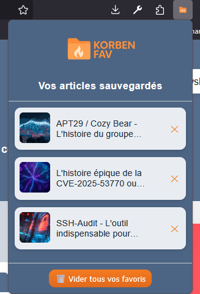

# KorbenFav

> Version : **1.0.0**

**KorbenFav** est une extension pour navigateur qui permet de sauvegarder vos articles préférés du site [Korben.info](https://korben.info) et de les retrouver facilement depuis une popup dédiée.

---

## Fonctionnalités

- Ajout d’un bouton « ★ » sur chaque article du site [Korben.info](https://korben.info)
- Sauvegarde automatique de l’article (titre, image, URL) dans le stockage local
- Menu popup ergonomique listant tous les favoris
- Suppression individuelle ou totale des favoris
- Notification visuelle lors de l’ajout ou suppression
- Design cohérent avec l’univers de Korben

---

## Aperçu

> Exemple de popup avec favoris ajoutés.

---

## Installation manuelle

### Firefox

1. Ouvrez `about:debugging#/runtime/this-firefox`
2. Cliquez sur **"Charger un module complémentaire temporaire"**
3. Sélectionnez le fichier `manifest.json` du dossier du projet

### Chrome

1. Allez sur `chrome://extensions/`
2. Activez le **mode développeur**
3. Cliquez sur **"Charger l’extension non empaquetée"**
4. Sélectionnez le dossier contenant les fichiers du projet

---

## Installation via navigateur (prochainement)

KorbenFav sera bientôt disponible sur :

- [Chrome Web Store](https://chrome.google.com/webstore/) *à venir*
- [Firefox Add-ons (AMO)](https://addons.mozilla.org/) *à venir*

Une fois publié, vous pourrez installer l’extension d’un simple clic sans passer par le mode développeur et ainsi garder réellement vos favoris sauvegardés !

---

## Licence

Ce projet est open-source sous licence [MIT](LICENSE).  
KorbenFav n’est pas affilié au site [Korben.info](https://korben.info).

---

## Auteur

**Calvin Nogueira**

